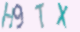

generate image captcha for ml


example:
```
python3 gen.py img /root/captcha_gen/dd 1000
``` 

---

            use：python3 gen_verification_code.py argv[1] argv[2] argv[3]
            argv[1]: img / list             |-> 
                    img 生成图片+列表文件；list 根据目录生成图片列表
            argv[2]: {img_path}(文件夹路径)  |-> 
                    如果argv[1]是img，则该目录为生成图片的路径；
                    如果argv[1]是list,则生成该目录下图片的列表文件，且该列表文件保存在该目录下
            argv[3]: {num}(数量，正整数)     |->
                    生成图片的数量，或者生成图片列表中的图片数量
                    如果在选择生成list时，该数量大于目录下总图片数，则生成的列表长度为总图片数，即num = min{argv[3], num of 目录下图片数}
                    
            示例:   生成图片： python3 gen_verification_code.py img ~/data/img 10000  
                        |->   在~/data/img文件夹下生成10000张验证码图片
                    生成列表： python3 gen_verification_code.py list ~/data/img 10000 
                        |->   在~/data/img文件夹下该目录下图片的一个列表文件，长度最多10000


---

add noise dots and noise curve by **uncommiting line 133 134**

```
        #self.create_noise_dots(img)
        #self.create_noise_curve(img)
```


sample img:

